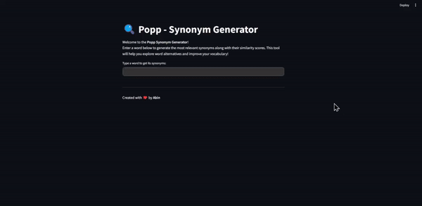

# Synonym Generator for Popp

### [Click here to view the demo video.](https://drive.google.com/file/d/1uHKrl6QuPWyypLy7zgWIloNyf33dAf5j/view?usp=sharing)

This is a simple **Synonym Generator** application developed for the **Popp** take-home task. The app uses **FastAPI** for the backend and **Streamlit** for the frontend to provide a seamless and interactive experience. 

## Project Overview

The Synonym Generator allows users to input a word and receive a list of its top synonyms, each accompanied by a similarity score. The backend communicates with **OpenAI's GPT-3.5 model** to generate these synonyms, while the frontend (built using **Streamlit**) displays the results in a clean and interactive interface.

### Key Features:
- **Synonym Generation**: Fetches top synonyms for a given word from OpenAI's GPT-3.5 model.
- **Similarity Scores**: Displays similarity scores for each synonym, providing users with an understanding of how closely related the synonyms are to the original word.
- **Dark and Light Theme Support**: The UI adjusts dynamically to the user's theme preference (light or dark mode).
- **Real-Time Updates**: The frontend fetches synonyms in real-time as the user types the word.

## Tech Stack

- **Frontend**: [Streamlit](https://streamlit.io/) 
- **Backend**: [FastAPI](https://fastapi.tiangolo.com/)
- **API Service**: OpenAI's GPT-3.5 for generating synonyms based on user input. 

**Developed with ❤️ by Abin**
